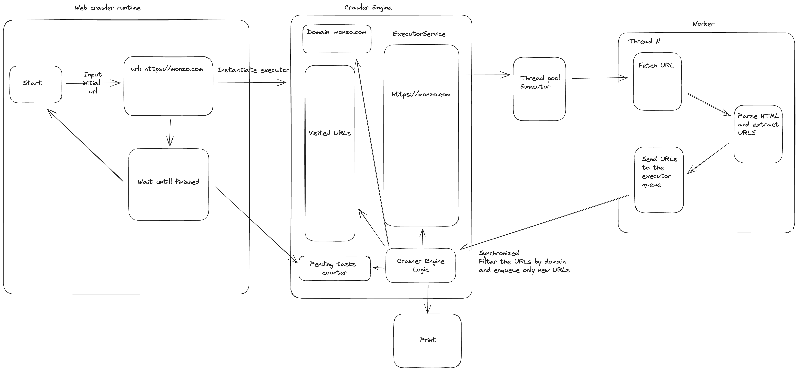

# Web Crawler

Starting from an initial URL, this web crawler will fetch and print all the links it can find in a webpage. 
Then it will enqueue and process the URLs not already visited and with the same domain as the initial one.

## Architecture

We have three main components:
 - A Web Crawler runtime that is taking care of interfacing with the user for the initial url, spinning up the engine and waiting for the process to finish
 - A Web Crawler Engine that is taking care of enqueuing the new URLs to be processed, printing the results and keeping the status of the entire process
 - A Worker that is taking care of fetching the data from the URL, parsing the page and extracting the links



## Setup and run the service
This service requires Java 21 to run.

NOTE: if you don't want to install Java you can build it and run it using Docker, see [below](#run-the-application-using-docker).

### Install Java 21
If you don't have Java already on your machine you can easily install it using [SDKMAN!](https://sdkman.io/). \
First, install SDKMAN! ([here](https://sdkman.io/install)) running the following command:
```shell
curl -s "https://get.sdkman.io" | bash
source "$HOME/.sdkman/bin/sdkman-init.sh"
```
Then install Java using the Env command ([here](https://sdkman.io/usage))
```shell
sdk env install
# you can simply do "sdk env" after the first installation
```

### Run the application
A makefile has been added to simplify this process.

Open a terminal and 
To build and run the application simply do
```shell
make
# or make run
```
If for any reasons it should not work correctly, you can try
```shell
make jar
```

### Run the application using Docker
A Docker file is provided to build and run the application in case you don't want to install Java.

Open a terminal in the root directory of the project and run the following commands:
```shell
docker build -t webcrawler .
docker run -it --rm webcrawler
```